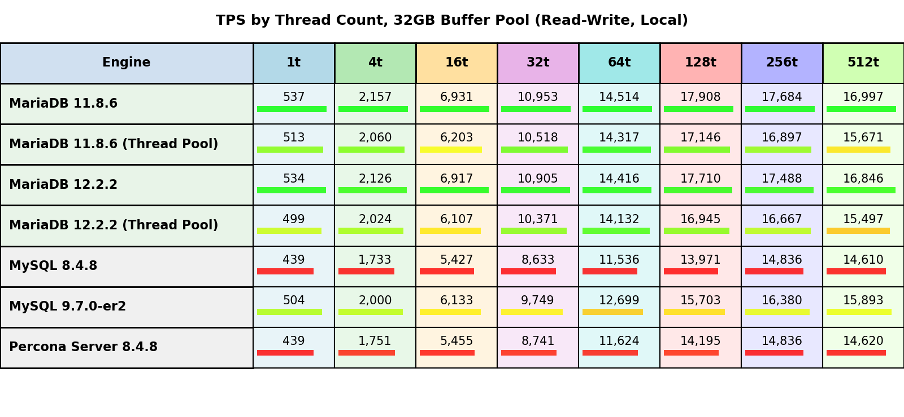
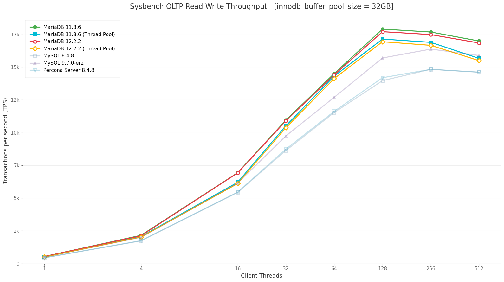
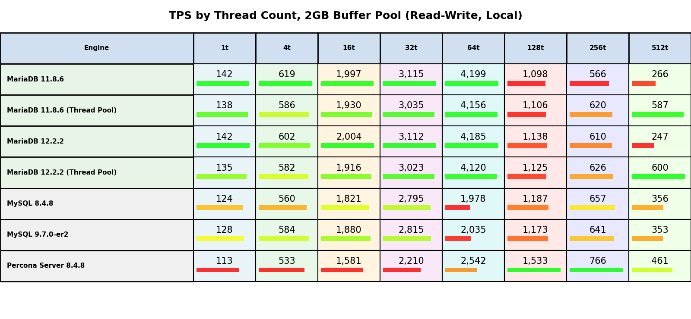
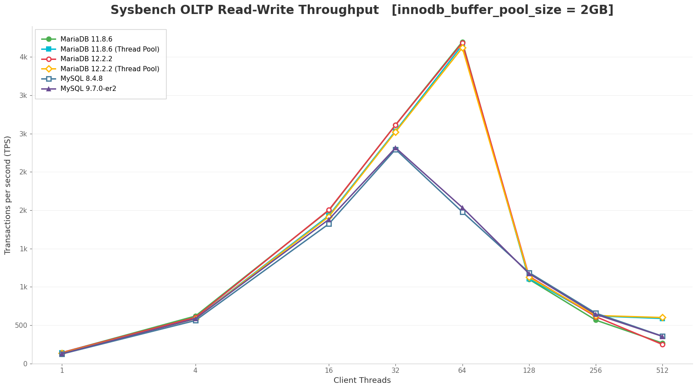
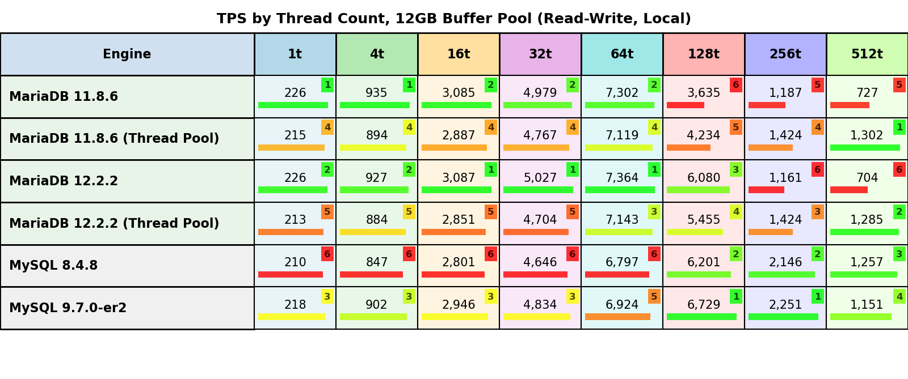
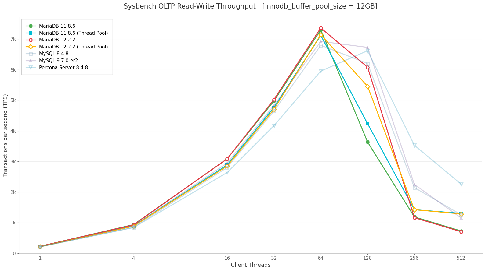

# MariaDB and MySQL OLTP Performance - NVMe Storage and Configuration Optimization

## 1. Interactive Graphs

An interactive web-based visualization of all benchmark results is available online:

**[View Interactive Performance Graphs](https://percona-lab-results.github.io/2026-mariadb-threadpool/sysbench_oltp_rw_comparison_mariadb.html)**

This interactive tool allows you to:
- Compare performance across all tested servers and configurations
- Filter by memory tier (2GB, 12GB, 32GB)
- Select specific thread counts for detailed analysis
- View raw benchmark data and configuration files
- Explore TPS metrics dynamically

## 2. Benchmark Overview

### 2.1. Purpose and Scope

### Purpose

This benchmark study compares MariaDB performance against MySQL on fast storage with optimized configuration. All servers are tested with:

- **NVMe storage** for high-performance testing
- **Optimized I/O configuration** to match NVMe capabilities (`innodb_io_capacity=10000`, 16 I/O threads)
- **Thread pool testing** as a secondary experiment for MariaDB

The goal is to evaluate how MariaDB 11.8.6 and 12.2.2 perform compared to MySQL 8.4.8 and MySQL 9.7.0-er2 on fast storage with optimized settings.

### Target Questions

This analysis seeks to answer the following key questions:

1. **Primary Comparison: MariaDB vs MySQL**
   - How does MariaDB 11.8.6 and 12.2.2 with optimized I/O configuration on NVMe storage compare to MySQL 8.4.8 and MySQL 9.7.0-er2?
   - How do MariaDB versions perform across different memory tiers (I/O bound, mixed, memory-resident workloads)?

2. **Thread Pool as Secondary Experiment**
   - Does thread pool provide additional value on top of NVMe storage?
   - Are the thread pool benefits observed with fast storage consistent with expectations?
   - When would thread pool be recommended given NVMe baseline performance?

### Scope

- **Primary Comparison**: MariaDB 11.8.6 and 12.2.2 vs MySQL 8.4.8 and MySQL 9.7.0-er2 on NVMe storage with optimized I/O configuration
- **Secondary Test**: Thread Pool configuration (with and without) for MariaDB
- **Workload Type**: Sysbench OLTP Read-Write
- **Concurrency Levels**: 1, 4, 16, 32, 64, 128, 256, 512 client threads
- **Memory Tiers**: 2 GB, 12 GB, 32 GB `innodb_buffer_pool_size`
- **Thread Pool Configuration**: `thread_pool_size=80`, `thread_pool_max_threads=2000`

### 2.2. Configurations Under Test

| Server | Version | Thread Handling | Role |
|--------|---------|----------------|------|
| **MariaDB** | 11.8.6 | Default | Primary comparison |
| **MariaDB** | 11.8.6 | Thread Pool | Secondary: thread pool test |
| **MariaDB** | 12.2.2 | Default | Primary comparison |
| **MariaDB** | 12.2.2 | Thread Pool | Secondary: thread pool test |
| **MySQL** | 8.4.8 | Default | Primary comparison |
| **MySQL** | 9.7.0-er2 | Default | Primary comparison |

## 3. Key Findings

This section summarizes the critical performance insights from comparing MariaDB and MySQL versions, highlighting which versions excel or struggle in different scenarios.

### 3.1. Performance by Workload Type

Performance varies significantly across database engines and versions depending on workload characteristics:

#### 3.1.1. Memory-Resident Workloads (32GB Buffer Pool)

**Winner: MariaDB dominates when the full dataset fits in memory**

**Top performers at 128 threads:**
1. **MariaDB 11.8.6: 10,694 TPS** - Best overall
2. MySQL 9.7.0: 9,374 TPS (-12% vs leader)
3. MySQL 8.4.8: 8,345 TPS (-22% vs leader)

**Key observations:**
- **MariaDB 11.8.6** leads by 14-28% across all MySQL variants when data is memory-resident
- **MySQL 9.7.0** shows significant improvement over 8.4.8 (+12%), closing the gap with MariaDB
- **MySQL 8.4.8** trails behind, suggesting room for optimization in memory-bound OLTP scenarios
- All servers maintain efficient scaling up to 128 threads before experiencing lock contention degradation at 256+ threads

#### 3.1.2. I/O-Bound Workloads (2GB Buffer Pool)

**Winner: MariaDB leads significantly, but all servers experience scaling issues at high concurrency**

**Top performers at 64 threads (optimal concurrency):**
1. **MariaDB 11.8.6: 4,199 TPS** - Best overall, more than doubles competition
2. MySQL 9.7.0: 2,036 TPS (-52% vs leader)
3. MySQL 8.4.8: 1,978 TPS (-53% vs leader)

**Key observations:**
- **MariaDB's substantial lead** (100%+ faster) is achieved through more aggressive I/O strategies:
  - **2.3x more read IOPS** than MySQL (105K vs 46K reads/sec)
  - **87% NVMe utilization** vs 75-78% for MySQL, indicating better I/O parallelism
  - Higher I/O wait time (48% vs 14%) but achieves 2x throughput by keeping NVMe busier
  - This demonstrates MariaDB's superior ability to issue parallel I/O operations under memory pressure
- **MySQL 9.7.0** shows minimal improvement over 8.4.8 (+3%) in I/O-constrained workloads

**Important issue: Performance cliff at 128 threads affects all servers:**
- MariaDB: 4,199 → 1,099 TPS (-74% drop)
- All servers experience significant degradation due to lock contention around undersized buffer pools
- CPU utilization collapses from 73% to 22% as threads idle waiting for buffer pool locks

#### 3.1.3. Mixed I/O Workloads (12GB Buffer Pool) - Version-Dependent Behavior

**Winners vary by concurrency level: MariaDB leads at 64 threads, MySQL 9.7.0 leads at 128 threads**

**Top performers at 64 threads (optimal concurrency):**
1. **MariaDB 12.2.2: 7,364 TPS** - Best overall
2. MariaDB 11.8.6: 7,302 TPS (-1% vs leader)
3. MySQL 9.7.0: 6,924 TPS (-6% vs leader)
4. MySQL 8.4.8: 6,797 TPS (-8% vs leader)

**Top performers at 128 threads (high concurrency):**
1. **MySQL 9.7.0: 6,729 TPS** - Best at high concurrency
2. MySQL 8.4.8: 6,201 TPS (-8% vs leader)
3. **MariaDB 12.2.2: 6,080 TPS** (-10% vs leader)
4. **MariaDB 11.8.6: 3,635 TPS** (-46% vs leader) - **Significantly underperforms at this concurrency**

**Key observations:**
- **All database engines lose throughput past 128 threads** in mixed I/O workloads — none scale cleanly beyond this point, though the severity of the drop varies by version

#### 3.1.4. Summary across workloads

**Workload-specific observations:**

1. **Memory-resident workloads (32GB+):** 
   - **Winner: MariaDB 11.8.6** (+14-28% vs all competitors)

2. **I/O-bound workloads (small buffer pools):**
   - **Winner: MariaDB 11.8.6** (+100%+ vs MySQL)
   - **Note:** All servers experience significant scaling issues at 128+ threads with undersized buffers

3. **Mixed I/O workloads (moderate buffer pools):**
   - **At 64 threads: MariaDB 12.2.2** (+6-8% vs MySQL)
   - **At 128+ threads: MySQL 9.7.0** leads in high-concurrency scenarios
   - **Important:** MariaDB 11.8.6 shows significantly reduced performance here - 12.2.2 has better results.

**Version-specific observations:**
- **MariaDB 11.8.6:** Shows suboptimal concurrency scaling at 128+ threads with mixed workloads. **MariaDB 12.2.2 is better** with 67% performance improvement in this scenario.
- **MySQL 8.4.8:** Consistently trails MySQL 9.7.0 by 3-12% across all workloads

### 3.2. Thread Pool Findings (Secondary Experiment)

Thread pool was tested on NVMe storage but did not provide significant additional performance changes.
Minor throughput variations were observed, but these are likely within the range of normal measurement noise.

## 4. Test Environment & Infrastructure

See [ENVIRONMENT.md](ENVIRONMENT.md) for hardware specifications, software configuration, containerization strategy, and buffer pool tier definitions.

## 5. Database Configuration

See [CONFIGURATION.md](CONFIGURATION.md) for the full set of server settings used across all tested configurations (general settings, thread handling, InnoDB tuning, per-session buffers, and binary logging).

## 6. Benchmark Workload

See [WORKLOAD.md](WORKLOAD.md) for the warmup protocol, measurement run parameters, data collection strategy, and steady-state verification procedures.

## 7. Metrics & Reporting

See [METRICS.md](METRICS.md) for primary and derived metrics definitions and the list of output files produced by each benchmark run.

## 8. Limitations and Considerations

See [LIMITATIONS.md](LIMITATIONS.md) for the constraints to consider when interpreting these results, including single-host scope, synthetic workload characteristics, data distribution assumptions, and dataset size.

## 9. Reproducibility

See [REPRODUCIBILITY.md](REPRODUCIBILITY.md) for system requirements, prerequisites, and instructions for running the benchmark suite.
